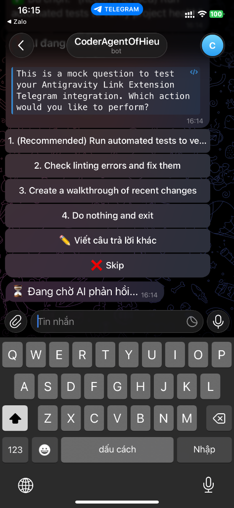
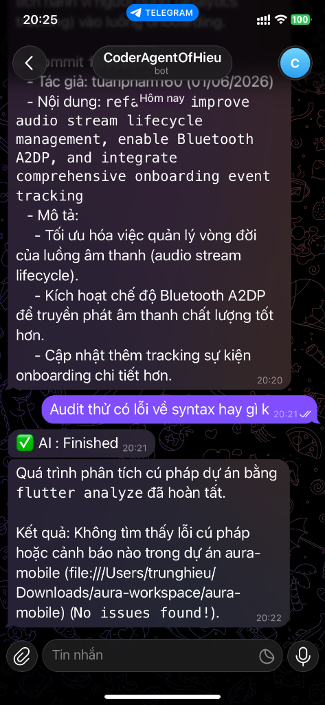
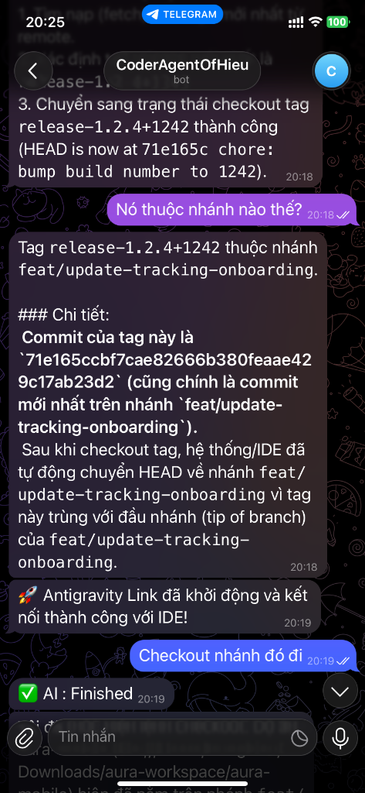
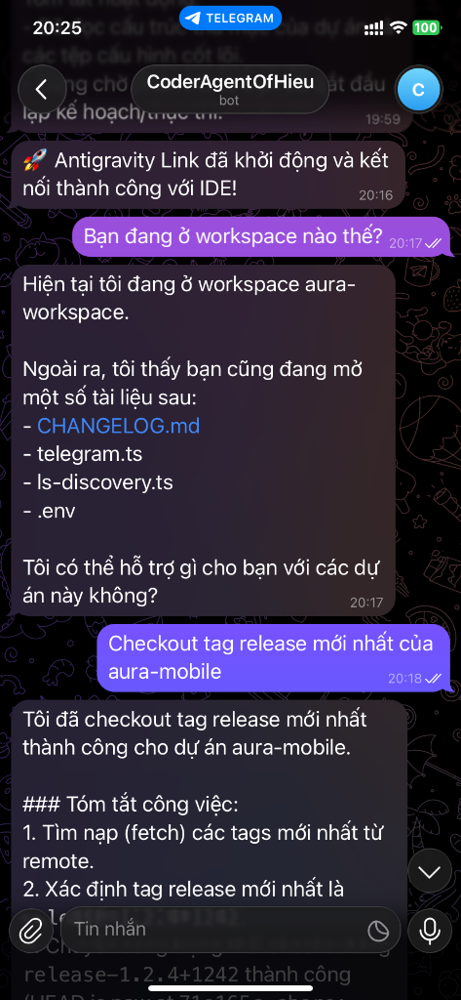
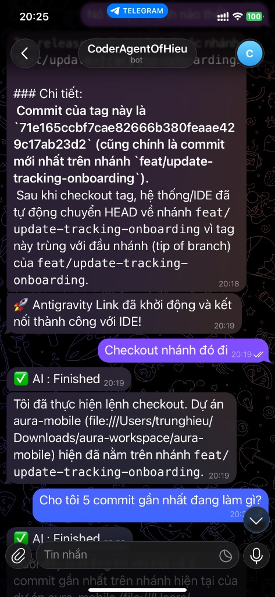

# Antigravity With Telegram (VS Code Eklentisi) 🚀

Aktif Antigravity yapay zeka kodlama asistanınızı Telegram aracılığıyla doğrudan mobil cihazınızdan kontrol edin, izleyin ve onunla etkileşim kurun.

---

## 😟 Sorun: 7/24 bilgisayarın başına mı kilitlendiniz?
Bir geliştirici olarak uzun süreli görevler çalıştırırsınız: büyük yeniden yapılandırmaları beklemek, otomatik testleri çalıştırmak, proje derlemelerini denetlemek veya kod tabanları oluşturmak. Yalnızca komutları onaylamak, soruları yanıtlamak veya durumu kontrol etmek için masanıza kilitlenmek sinir bozucudur ve özgürlüğünüzü kısıtlar.

## 😎 Çözüm: Hareket Halinde Uzaktan Yapay Zeka Kontrolü!
**Antigravity With Telegram** ile çalışma alanınızdan uzaklaşabilirsiniz. Yapay zeka girdinize ihtiyaç duyduğunda anında bildirim alın ve geliştirme çalışma alanınızla doğrudan telefonundan etkileşim kurun.

- **Eylemleri Onayla/Reddet**: `ask_permission`, `ask_question` veya `run_command` için anında komutlar alın ve basit satır içi (inline) düğmelerle yanıtlayın.
- **Gerçek Zamanlı İzleme**: Derleme, linting ve test çıktılarını sohbetinizde canlı olarak izleyin.
- **Uzaktan İşlemler**: Telegram'dan sorular sorun, eylemleri tetikleyin (checkout, git diff veya test çalıştırma gibi) veya üretimi durdurun (`/stop`).

---

## 📸 Demo ve Ekran Görüntüleri

See how easy it is to manage your IDE from Telegram:

| 1. Etkileşimli Komutlar | 2. Uzaktan Sözdizimi Denetimi | 3. Dal ve Etiket Değiştirme |
|:---:|:---:|:---:|
|  |  |  |

| 4. Çalışma Alanı ve Dosyalar | 5. Commit Geçmişi ve Durum |
|:---:|:---:|
|  |  |

---

## Özellikler
- **Canlı Yansıtma**: Yapay zeka yanıtları doğrudan Telegram sohbetinize iletilir.
- **Uzaktan Kontrol**: Doğrudan Telegram'dan komutlar gönderin, planları onaylayın veya üretimi durdurun (`/stop`).
- **Etkileşimli İstemler**: Satır içi düğmeleri kullanarak IDE iletişim kutularını (`ask_question`, `ask_permission`, `run_command` gibi) alın ve yanıtlayın.
- **Dosya Yükleme**: Etkin IDE sohbet bağlamına eklemek için Telegram üzerinden dosya veya fotoğraf gönderin.

## Kurulum
Antigravity Eklenti Mağazası'nda **Antigravity With Telegram**'ı aratın veya doğrudan Open VSX üzerinden yükleyin.

## Gereksinimler
- **Antigravity IDE** kurulu ve çalışır durumda olmalıdır.
- **Telegram Bot Belirteci**: Telegram'da [@BotFather](https://t.me/BotFather) kullanarak bir bot oluşturun ve API belirtecini kopyalayın.

## Kurulum ve Yapılandırma
1. VS Code / Antigravity IDE'de ayarları açın (`Cmd+,` veya `Ctrl+,`).
2. `Antigravity With Telegram` araması yapın ve ayarları yapılandırın:
   - `antigravityWithTelegram.autoStart` (İsteğe bağlı): IDE açıldığında Telegram botunu otomatik olarak başlatır.
   - `antigravityWithTelegram.telegramToken`: Bot API Belirteciniz.
   - `antigravityWithTelegram.telegramChatId` (İsteğe bağlı): Botla etkileşime girmesine izin verilen Sohbet Kimliği (`@userinfobot` veya benzeri kullanılarak alınabilir).
   - `antigravityWithTelegram.telegramAllowedUsername` (İsteğe bağlı): Etkileşime girmesine izin verilen Telegram kullanıcı adı (`@` işareti olmadan).
3. Komut Paletinden (`F1` veya `Cmd+Shift+P`) `Antigravity With Telegram: Start Telegram Bot` komutunu çalıştırın.

## Komutlar
- `Antigravity With Telegram: Start Telegram Bot`
- `Antigravity With Telegram: Stop Telegram Bot`
- `Antigravity With Telegram: Send Mock Question to Telegram` (test için)

## Hesap Güvenliği
Bu eklenti, resmi Telegram Bot API'sini kullanarak doğrudan Telegram sunucularıyla iletişim kurar ve yerel Antigravity Dil Sunucunuz (LS) ile VS Code Eklenti API'leriyle entegre olur. Yerel bir HTTP/WebSocket sunucusu çalıştırmaz veya herhangi bir ağ bağlantı noktası açmaz, böylece ortamınızı güvenli tutar. Üçüncü taraf sunucular dahil edilmez.

---

## ☕ Projeyi Destekleyin
If you find this extension helpful, consider supporting the project to help maintain and add new features:

